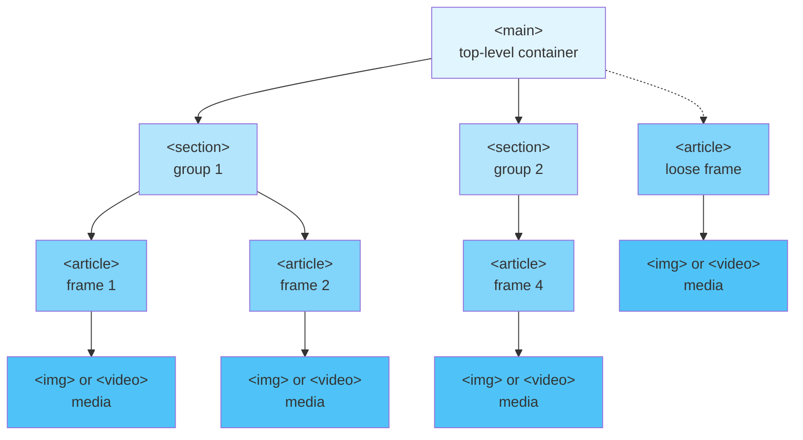

# Structure

Put the presentation content into the `<main>` tag, which contains `<article>` tags (~ frames).



## How attributes resolve

To control the presentation flow, we use many attributes. These are resolved in the following way:

* `<div sli-attribute>` → true
* `<div sli-attribute=''>` → true
* `<div sli-attribute='true'>` → true
* `<div sli-attribute='false'>` → false
* `<div sli-attribute='1'>` → 1 (also true)
* `<div sli-attribute='0'>` → 0 (also false)
* `<div sli-attribute='value'>` → value
* `<div>` → default

An element affected by an attribute searches for it amongst its own or its ancestors' attributes.

```html
<main sli-attribute="1" >
     <!-- → value=1 -->
      <!-- → value=2 -->
</main>
```

## Naming the presentation

Give the whole presentation a name with `sli-title` on `<main>` – the same attribute a `<section>`
uses for its own display name, one level up. Four places to set it: the field on the splash screen
(blends in as the "Start presenting" label until hovered/focused), <kbd>Alt+N</kbd> during playback,
the field at the top of the export dialog (<kbd>Ctrl+S</kbd>), or clicking the "Presentation" title
directly in the grid overview (<kbd>G</kbd>) – section titles there are click-to-rename the same way.
The name is mirrored to the document `<title>` (browser tab), shown in the splash **Recent** list, and
– slugified – becomes the **export filename** (so a presentation named *Dovolená 2019* exports as
`dovolena-2019.html` instead of the default `slidershow.html`).

```html
<main sli-title="Dovolená 2019"> … </main>
```

## Exporting

<kbd>Ctrl+S</kbd> opens one dialog with a single **Export** button; everything above it says what
kind of export it will be.

**Media** – what happens to the photos and videos:

* **Referenced where they are now** (default) – writes just the presentation file, a few
  megabytes even for [ten thousand photos](organizing.md#large-collections). The **Media folder
  path** field below it says where the exported file should look for them: leave it empty for
  "right next to me", or give a path (relative to the export, or absolute) such as `media/` or
  `../shared-photos/`. It is remembered as `sli-path` on `<main>`.
    * **Media paths** – whether an already-referenced path is rewritten on the way out: kept as it
      is, forced relative (strips this server's origin off, for hosting the export elsewhere with
      the same layout), or forced absolute (resolved against this page's address, for a
      presentation served from a dev server whose URL won't be the final one). Files dropped in
      from disk carry their own bytes and are never touched by this.
* **All inside one single file** – every photo/video embedded as a data URI. One self-contained
  file, at the price of its size and a lot of memory while exporting.
* **Copied into a media/ folder next to the file** (Chrome/Edge) – self-contained like the single
  file, but the media stay real files, so the HTML stays small.
* **Split into folders by tags** (Chrome/Edge) – an album export rather than a presentation one;
  see [Exporting tags to album folders](organizing.md#exporting-tags-to-album-folders).

**App's own code** – where the exported file gets SlideRshow itself from:

* **Load from CDN** (default) – fetched again on next open, so the export needs network.
* **Inline into the file** – embedded verbatim; opening it later needs no network at all.
* **Copy into a folder** (Chrome/Edge) – written as `slidershow/` + `vendor/` folders next to the
  export, which is pointed at them.
* **Point at a copy I already have** – give a directory relative to the exported file (ex:
  `slidershow/`, `../lib/slidershow/`) or an absolute URL, and the export loads SlideRshow from
  there. Nothing is copied, so several presentations can share a single offline copy made once with
  the previous option.

The middle two have to re-read this presentation's own files, which Chrome refuses under `file://` –
host the presentation over http(s) to use them. The last one copies nothing, so it works anywhere.

## Frame `<article>`

Every frame is represented by an `<article>` tag.

```html
<article></article>
```

It contains arbitrary HTML code, such as images or videos (by default, one per slide). Use control attributes:

### `sli-duration`
(default `0`) How many seconds a frame step will last. By default, indefinitely (waiting for a user action).

```html
<article sli-duration="0.5">Short frame</article>
<article>You have to click to get further</article>
<article sli-duration="0.5">Short frame</article>
```

Note a video frame is an exception: it will hold till the video finishes and then change frame.

Auto-forward can also be set live with <kbd>Shift+Alt+f</kbd>, and a thin **countdown bar** at the bottom edge (toggle <kbd>Shift+c</kbd>, off by default) shows how long until the next frame.

### `sli-loop-presentation`
(default off, set on `<main>`) When the presentation reaches its last frame, loop back to the first one instead of stopping – for kiosk / exhibition playback (pair it with `sli-duration` for a hands-free loop). Toggle live with <kbd>Shift+L</kbd>, or use the **🔁 Kiosk** splash button. The narrower-scoped [`sli-loop`](#sli-loop) is a different feature – it loops several images *within* one frame.

### `sli-transition-duration`
(default `0`) How many seconds it will take to change a frame.

### `sli-spread-frames`
(default `spiral`) A viewport stands for a chessboard field. This is how the frames are positioned on the chessboard.

* `true=spiral`
* `diagonal`

### `sli-x`, `sli-y`
Valid only for `sli-spread-frames=diagonal`. Overrides the default position. Attention: do not let frames share the same position.

### `sli-loop`
If present, images in the body will rapidly loop, creating a funny animation. (Currently only the `true` value is allowed, for an infinite loop.)

```html
<article sli-loop>
    
    
</article>
```

### `id`
Standard HTML ID serves for navigation.

```html
<article>
    <a href="#my_frame">go to a specific frame</a>
    <a href="#my_section">go to the first frame in a specific section</a>
    <a href="#2">go to the second frame (number may change if you add frames later)</a>
</article>
<section id=my_section>
    <article>...</article>
    <article id=my_frame>...</article>
</section>
```

### `sli-tag`
Set by the [tagging feature](organizing.md#tagging) on the frame's ``/`<video>`, not hand-authored. Space-separated list of digit tokens, e.g. `sli-tag="1 2"` for a frame in both tag 1 and tag 2.

### `sli-tag-names`
On `<main>`: pipe-delimited display names for tags, position = digit (`sli-tag-names="rodiče | vedoucí"` names tag 1 "rodiče" and tag 2 "vedoucí"). Backslash-escape for literal pipes: `sli-tag-names="role\|with\|pipes | other"`. Digits past the list still work, shown as bare numbers.

### `sli-tag-hidden`
On `<main>`: space-separated digit tokens of [tags](organizing.md#hiding-tags) marked hidden, e.g. `sli-tag-hidden="0 2"`. `0` is a sentinel meaning "frames carrying no tag at all" (the digit `0` can never be a real tag – it clears a frame's tags instead). Set from the "Name tags…" dialog, not hand-authored.

### `sli-tag-hidden-mode`
On `<main>`: one of `dim` (default), `hide`, `show` or `lock` – how frames matched by `sli-tag-hidden` are treated, see [Hiding tags](organizing.md#hiding-tags). Written directly (not undoable) by the "Cycle hidden-tag view" command; overridable per-session via the URL hash.

### `sli-rotate`
**(number in degrees)** Any content can easily be rotated. Use the buttons in the menu to rotate live.

### `<!-- presenter's notes -->`
You may use HTML comments just before the frame or as the first frame child. Markdown syntax is supported. These will be displayed in the [auxiliary window](organizing.md#auxiliary-window) while presenting.

Notes can be written from the app too, no hand-editing needed: the *notes* field at the top of the properties panel (<kbd>Alt+P</kbd>), or the roomier "Presenter's notes…" dialog (<kbd>Alt+Shift+N</kbd> in editing mode, <kbd>Alt+E</kbd>). Either way the text ends up in the very same HTML comment, so it survives an export. Emptying the field removes the comment.

Before the frame:

```html
<!-- I should talk about cats. -->
<article></article>
```

Inside the frame:

```html
<article>
    <!-- I should talk about cats. -->
    
</article>
```

## Frame group `<section>`
`<article>` tags may be encapsulated into (nested) `<section>` groups. A `<section>` has the same attributes as an `<article>`.

```html
<section sli-duration='0.5'>
    <article>Short frame (inherits 0.5)</article>
    <article sli-duration='0'>You have to click to get further.</article>
    <article>Short frame (inherits 0.5)</article>
</section>
```

As the ultimate default, the `<main>` tag may be used.

```html
<main sli-duration='0.5'>
    <article>Short frame (inherits 0.5)</article>
</main>
```

### Nested `<article>` tags

You may nest an `<article>` beneath another one, which causes the children to be hidden and shown on top of the parent when their time comes.

```html
<article>
    
    <article>That is a flower!</article>
</article>
```

## Template

### Header and footer

`<header>` and `<footer>` tags used within a `<template>` are automatically inserted into frames that do not yet contain such tags. (Put the `<template>` outside `<main>`.)

```html
<template>
    <footer>This is the default footer</footer>
</template>

<main>
    <article>
        Here we get an automatic footer
        <!-- Inserted: <footer>This is the default footer</footer> -->
    </article>

    <article>
        No footer will be appended here
        <footer></footer>
    </article>
</main>
```
